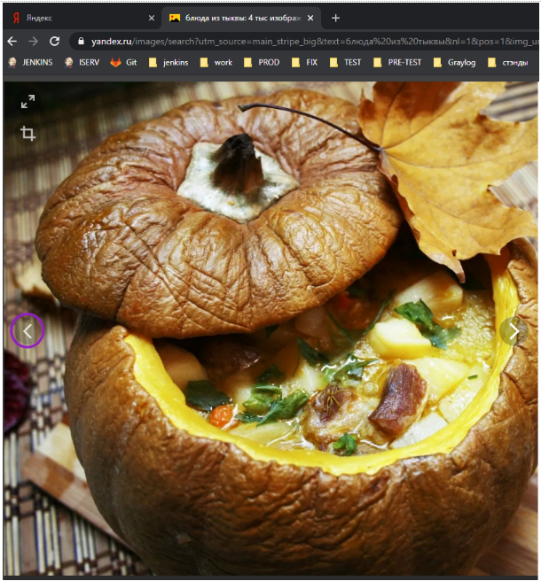

# Тестовое задание на позицию разработчика в тестировании
Необходимо автоматизировать проверку следующих сценариев:
## Сценарии тестирования
### Поиск в яндексе
1. Зайти на yandex.ru
2. Проверить наличия поля поиска
3. Ввести в поиск Тензор
4. Проверить, что появилась таблица с подсказками (suggest) 

5. При нажатии Enter появляется таблица результатов поиска
6. В первых 5 результатах есть ссылка на tensor.ru
### Картинки на яндексе

1. Зайти на yandex.ru
2. Ссылка «Картинки» присутствует на странице
3. Кликаем на ссылку
4. Проверить, что перешли на url https://yandex.ru/images/
5. Открыть 1 категорию, проверить что открылась, в поиске верный текст

6. Открыть 1 картинку , проверить что открылась

7. При нажатии кнопки вперед  картинка изменяется

8. При нажатии кнопки назад картинка изменяется на изображение из шага 6. Необходимо проверить, что это то же изображение.

## Правила выполнения задания
1. Автотесты реализованы на Python3 и Selenium Webdriver
2. Необходимо использовать тестовый framework (pytest, unittest и тд)
3. Желательно реализовать PageObject паттерн или воспользоваться сторонней библиотекой
4. Желательно, чтобы при падении теста генерился понятный отчет
5. Если будут использоваться сторонние инструменты, необходимо составить инструкцию по их установке и запуску.